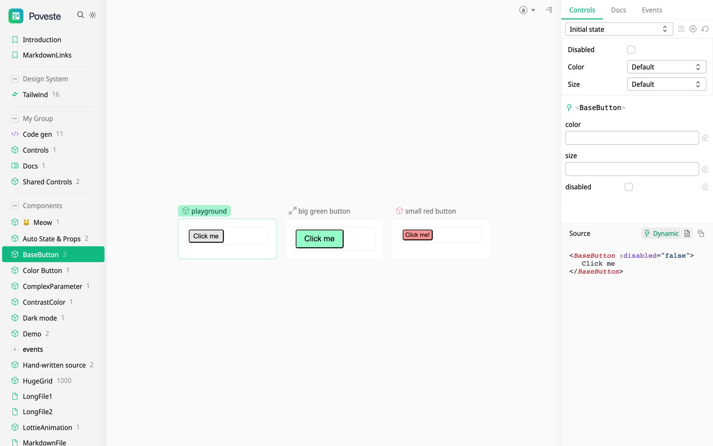

  

 

# Poveste

> Fast and beautiful interactive component playgrounds

**poveste** — /poˈveste/ (_po-VES-teh_), Romanian for "story." A community-maintained,
**drop-in successor** to [histoire](https://github.com/histoire-dev/histoire) by
[Guillaume Chau](https://github.com/Akryum). Existing histoire projects migrate by
swapping one dependency — the `<Story>`/`<Variant>` API, `.story.*` files, and
`histoire.config.*` all keep working. Say it however you like — we answer to "po-VEST" too. 🙂

[Read the Documentation](https://poveste.dev) |
[Discussions board](https://github.com/poveste-dev/poveste/discussions)

⚡️ Lightning fast development and instant HMR thanks to [Vite](http://vitejs.dev)
👓 Build and visually test your components in isolation
📚 Document your components with stories and variants
📝 Generate source code examples automatically
🎨 Beautiful and customizable interface

## Contributing

See [Contributing Guide](https://github.com/poveste-dev/poveste/blob/main/CONTRIBUTING.md) to learn more about the repository and how you can contribute.

## Sponsors

Become a sponsor!

- [Guillaume Chau](https://github.com/sponsors/Akryum)
- [Hugo Attal](https://github.com/sponsors/hugoattal)

We are very grateful to all our sponsors for their support:

### [Guillaume Chau](https://github.com/sponsors/Akryum)

  

## License

MIT
